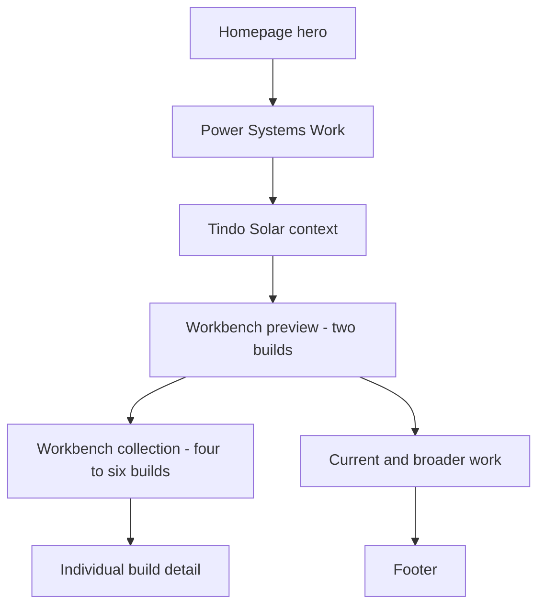

# Portfolio Workbench Personality Layer - Plan

## Goal Capsule

- **Objective:** Show Nathan's genuine engineering interest through a curated, honestly attributed Workbench without weakening the portfolio's recruiter-first evidence hierarchy.
- **Product authority:** This Product Contract governs the Workbench personality layer and the approved narrow homepage corrections. `DESIGN.md` remains authoritative for the established visual system.
- **Open blockers:** The complete 4-6 build inventory, attribution sources, and second homepage preview entry remain to be selected. The soldering fume extractor still needs build notes and test results. These block publication of incomplete entries, not technical planning.

---

## Product Contract

### Summary

Add a Workbench personality layer that uses real engineering-adjacent builds, first-person reflection, and explicit authorship labels to show curiosity through behaviour. The homepage previews two builds and links to a dedicated collection of 4-6 entries, while verified power work remains the strongest professional evidence.

### Problem Frame

The portfolio already communicates discipline, evidence, and a focused solar and grid-integration direction, but it does not show clearly that Nathan pursues engineering questions because he enjoys the work. Repeated section structures and clinical terms such as "Evidence ledger" make the site feel more like a polished assessment record than a person actively learning through physical systems.

Nathan has stronger personality evidence than the site exposes: regular garage benchwork, soldering and assembly, spare-time engineering learning, a deliberate move from comfortable hospitality work into solar manufacturing, and curiosity that extends beyond his production role. The safest detailed public proof comes from personal benchwork rather than employer incidents.

### Key Decisions

- **Hybrid Workbench surface** (session-settled: user-directed - chosen over homepage-only and dedicated-only placement: a homepage preview makes curiosity visible quickly while a dedicated collection protects evidence hierarchy and gives attribution enough space). Show two homepage entries and hold the full 4-6 entry collection on a dedicated Workbench surface.
- **Curated imperfections** (session-settled: user-directed - chosen over finished-only presentation and a chronological build log: selected failures and next iterations show learning without creating recruiter noise). Each entry shows what worked, what failed, and what would change next.
- **Engineering-adjacent scope** (session-settled: user-directed - chosen over all hand-made work and original-design-only scope: the collection stays professionally relevant while retaining honest learning from attributed builds). Include electronics, CAD, fabrication, test tools, experiments, and repairs.
- **Public-safe evidence split** (session-settled: user-directed - chosen over a detailed Tindo Solar incident: garage work provides specific proof without employer-sensitive detail). Keep Tindo Solar context high-level and use personal bench builds for detailed stories.
- **Explicit ownership taxonomy** (session-settled: user-approved - chosen over treating every build as a personal project: honest attribution protects credibility while still showing assembly, interpretation, adaptation, and troubleshooting). Label each entry as Original design, Adapted build, Reproduction, Experiment, or Repair.
- **Narrow interface correction** (session-settled: user-approved - chosen over broad visual redesign: fresh desktop and mobile review showed distinctive visual identity but clinical copy, repeated rhythm, and technical-image cropping). Preserve the field-notes system and correct only the surfaces that weaken warmth or evidence legibility.

### Requirements

**Portfolio hierarchy and discovery**

- R1. The homepage must keep verified power work ahead of Workbench content so professional evidence remains dominant.
- R2. The homepage must preview exactly two Workbench entries in a compact composition suitable for mobile scanning.
- R3. The Workbench preview must follow the Tindo Solar context and precede broader or in-progress engineering work.
- R4. A dedicated Workbench collection must hold 4-6 curated entries and provide a detail view for each build.
- R5. Workbench must remain distinct from Projects and must not enter primary navigation in the initial release; discovery comes from the homepage, About, and footer.

**Authorship, evidence, and content**

- R6. Every Workbench preview and detail view must display its build-type label prominently.
- R7. Adapted builds and reproductions must identify the original creator or source near the title and link to the source where one is available.
- R8. Unknown or restrictive licensing must limit the site to attribution, external linking, Nathan's own photos, and Nathan's own observations; source files or plans must not be redistributed without permission.
- R9. Every detail view must explain why Nathan built it, what he personally contributed, the main constraint, what worked, what failed, and the next iteration.
- R10. Every published entry must include Nathan's own build evidence, such as photos, CAD views, sketches, parts information, build notes, or test results.
- R11. A claim that a build works must name the observed behaviour or test supporting that claim. Missing test evidence must remain visibly pending.
- R12. Employer-sensitive equipment, incidents, people, processes, and technical details must not appear in Workbench content.

**Voice and personality**

- R13. Workbench copy must use candid first-person reasoning, concrete motives, understood technical detail, and honest uncertainty without converting curiosity into unsupported expertise.
- R14. The Workbench introduction must use the approved copy: "I spend a lot of spare time at my bench building things, partly to learn and partly because physical work helps me reset. Some builds are mine from the first sketch, while others follow or adapt someone else's design; they are labelled as such. This section is a collection of what I made, where I failed, and what I would change next."
- R15. The About surface may explain that Nathan moved from comfortable hospitality work into a degree-adjacent solar-manufacturing role because he wanted closer contact with engineering practice, while keeping employer-specific technical claims restrained.
- R16. Interface copy must prove interest through behaviour rather than using generic passion, innovation, readiness, or expertise claims.

**Narrow homepage corrections**

- R17. The homepage section currently called "Evidence ledger" must use the warmer professional title "Power Systems Work".
- R18. The primary jump action currently called "View verified work" must use "View selected work".
- R19. The plain-text recruiter and AI profile must remain available but its footer link must read as a quiet utility rather than a primary boxed action.
- R20. Broader and in-progress work must state its current stage once without repeating "systems design in progress" across heading, introduction, and status label.
- R21. Technical hero artifacts must remain legible at desktop and mobile widths; meaningful diagram content must not be cropped as decorative photography.
- R22. The established warm-paper palette, Barlow Condensed and Inter pairing, square geometry, hairline structure, restrained orange, and ink footer must remain recognisable.

**Responsive and accessible behaviour**

- R23. Workbench previews and detail views must preserve visible reading order, keyboard access, descriptive links, meaningful image alternatives, and at least 44 by 44 pixel interactive targets.
- R24. Homepage and Workbench surfaces must reflow without horizontal overflow at supported mobile widths and at 200% zoom.
- R25. Real build photography, CAD, and sketches must provide visual variation without creating a separate hobby-blog design language.

### Key Flows

- F1. Recruiter homepage scan
  - **Trigger:** A recruiter lands on the homepage.
  - **Steps:** The recruiter sees role and discipline, reviews selected power work, sees Tindo Solar context, then encounters two Workbench builds showing voluntary hands-on learning.
  - **Outcome:** Genuine interest becomes visible without displacing professional evidence.
  - **Covered by:** R1-R5, R13, R17-R22.
- F2. Workbench exploration
  - **Trigger:** A visitor follows the Workbench preview or a Workbench link.
  - **Steps:** The visitor reads the collection introduction, distinguishes build types, selects an entry, and reviews motivation, contribution, evidence, failures, and next iteration.
  - **Outcome:** The visitor understands both Nathan's curiosity and the limits of each ownership claim.
  - **Covered by:** R4-R16, R23-R25.
- F3. Attributed reproduction
  - **Trigger:** Nathan publishes a build based on another creator's plans.
  - **Steps:** The entry is labelled Reproduction or Adapted build, credits and links the source, states Nathan's contribution, and publishes only permitted material.
  - **Outcome:** Practical learning is visible without implying original authorship or redistributing protected work.
  - **Covered by:** R6-R12.

### Acceptance Examples

- AE1. **Covers R6-R11.** Given the soldering fume extractor was designed from Nathan's own first sketch, when it is published, then it is labelled Original design and shows the one-week constraint, Inventor work, assembly evidence, working behaviour, appearance limitations, incomplete parameterisation, and next test or redesign.
- AE2. **Covers R6-R10.** Given a bench build follows an online design, when it is published, then it is labelled Reproduction or Adapted build, credits the creator near the title, links the source, and separates the original design from Nathan's fabrication, modifications, and lessons.
- AE3. **Covers R7.** Given Nathan cannot trace a non-original build's creator or source, when preparing the entry, then the entry remains unpublished until attribution is resolved.
- AE4. **Covers R8.** Given the original source is known but redistribution permission is unclear, when the entry is published, then it links and attributes the source while showing only Nathan's own photos, observations, and permitted material.
- AE5. **Covers R10-R11.** Given a build operates but formal test results are missing, when the entry is drafted, then the observed behaviour is stated narrowly and testing remains labelled pending.
- AE6. **Covers R1-R5, R24.** Given a visitor opens the homepage at 390 pixels wide, when they scroll beyond Tindo Solar, then they see two compact Workbench previews before current work, with no horizontal overflow and without full detail-page content expanding the homepage.
- AE7. **Covers R19.** Given a visitor reaches the footer, when they scan the actions, then contact, resume, and project actions remain prominent while the plain-text profile remains discoverable as secondary utility.

### Success Criteria

- A recruiter can identify genuine hands-on engineering interest from the homepage without opening every Workbench entry.
- Verified power work remains visually and narratively stronger than Workbench content.
- A visitor can distinguish original, adapted, reproduced, experimental, and repair work before reading an entry in full.
- The soldering fume extractor entry communicates motivation, constraint, contribution, working result, shortcomings, and next iteration with supporting evidence.
- Homepage surface language feels professional and human rather than audit-oriented.
- Desktop and mobile layouts preserve technical-artifact legibility and have no horizontal overflow.

### Scope Boundaries

- Do not redesign the core visual system or introduce a new palette, font system, generic cards, rounded surfaces, gradients, heavy shadow, pixel art, miniature scenes, workshop props, or fake technical decoration.
- Do not move Workbench builds into the Projects collection or present reproduced work as original engineering design.
- Do not publish detailed Tindo Solar defect stories or other employer-sensitive incidents.
- Do not delete the plain-text recruiter and AI profile; change only its prominence and presentation.
- Do not include custom-domain purchase, broader resume strategy, or unrelated project-page redesign in this feature.
- Keep the previously deferred miniature evidence-window direction deferred.

### Dependencies and Assumptions

- Nathan can identify 4-6 engineering-adjacent builds with his own photos and traceable source information.
- The soldering fume extractor has photos, Inventor files, parameters, sketches, and a parts list; build notes and test results will be added before publication.
- At least one additional build can meet the homepage-preview evidence and attribution threshold.
- Existing portfolio evidence, disclosure, and accessibility boundaries remain authoritative unless this Product Contract explicitly changes them.

### Outstanding Questions

**Resolve before publication**

- Which build joins the soldering fume extractor in the initial two-entry homepage preview?
- Which 4-6 builds meet the source, evidence, and professional-relevance gates for the first Workbench collection?
- What observable tests and results support the soldering fume extractor's public working claim?

### Sources and Grounding

- `DESIGN.md` defines the current field-notes visual system and deferred miniature boundary.
- `docs/superpowers/specs/2026-07-13-solar-portfolio-visual-direction-design.md` records the recruiter-first hierarchy and evidence constraints inherited by this feature.
- `app/page.tsx` shows the current homepage sequence and clinical surface terms targeted by the narrow correction.
- `components/SiteFooter.tsx` shows the current utility-link treatment and plain-text profile prominence.
- `lib/projects.ts` distinguishes verified power evidence from broader and in-progress work.
