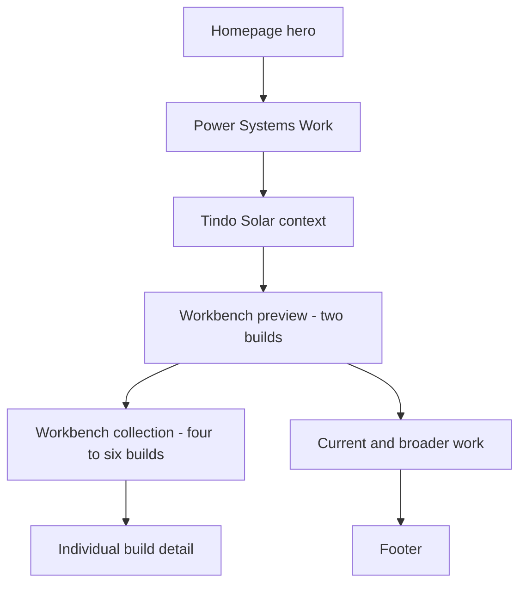
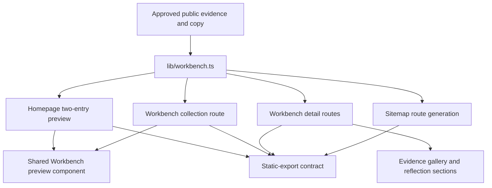
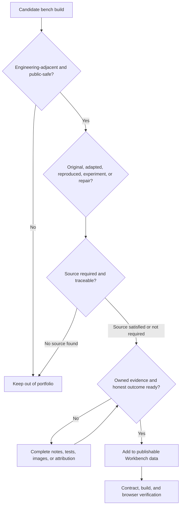

# Portfolio Workbench Personality Layer - Plan

## Goal Capsule

- **Objective:** Show Nathan's genuine engineering interest through a curated, honestly attributed Workbench without weakening the portfolio's recruiter-first evidence hierarchy.
- **Product authority:** This Product Contract governs the Workbench personality layer and approved narrow homepage corrections. `DESIGN.md` remains authoritative for the established visual system.
- **Execution profile:** Extend the existing static Next.js content architecture. Add typed Workbench data, static collection and detail routes, dedicated presentation components, contract coverage, and browser QA.
- **Stop conditions:** Do not publish Workbench routes until 4-6 entries and exactly two homepage previews pass the evidence, attribution, licensing, and public-safety gates. Do not invent missing build details, test results, sources, or employer claims.
- **Tail ownership:** Nathan supplies and approves the public content and owned evidence. The implementer owns route/component work, automated checks, responsive/accessibility remediation, and final verification.
- **Open blockers:** None for technical implementation. Content selection and evidence completion are execution dependencies that block publication, not planning.

---

## Product Contract

### Summary

Add a separate Workbench content model and static route family inside the existing engineering-field-notes system. The homepage previews two publishable builds, the collection holds 4-6 entries, and each detail page makes authorship, contribution, evidence, failure, and next iteration explicit while verified power work remains dominant.

### Problem Frame

The portfolio already communicates discipline, evidence, and a focused solar and grid-integration direction, but it does not show clearly that Nathan pursues engineering questions because he enjoys the work. Repeated section structures and clinical terms such as "Evidence ledger" make the site feel more like a polished assessment record than a person actively learning through physical systems.

Nathan has stronger personality evidence than the site exposes: regular garage benchwork, soldering and assembly, spare-time engineering learning, a deliberate move from comfortable hospitality work into solar manufacturing, and curiosity that extends beyond his production role. The safest detailed public proof comes from personal benchwork rather than employer incidents.

### Key Decisions

- **Hybrid Workbench surface** (session-settled: user-directed - chosen over homepage-only and dedicated-only placement: a homepage preview makes curiosity visible quickly while a dedicated collection protects evidence hierarchy and gives attribution enough space). Show two homepage entries and hold the full 4-6 entry collection on a dedicated Workbench surface.
- **Curated imperfections** (session-settled: user-directed - chosen over finished-only presentation and a chronological build log: selected failures and next iterations show learning without creating recruiter noise). Each entry shows what worked, what failed, and what would change next.
- **Engineering-adjacent scope** (session-settled: user-directed - chosen over all hand-made work and original-design-only scope: the collection stays professionally relevant while retaining honest learning from attributed builds). Include electronics, CAD, fabrication, test tools, experiments, and repairs.
- **Public-safe evidence split** (session-settled: user-directed - chosen over a detailed Tindo Solar incident: garage work provides specific proof without employer-sensitive detail). Keep Tindo Solar context high-level and use personal bench builds for detailed stories.
- **Explicit ownership taxonomy** (session-settled: user-approved - chosen over treating every build as a personal project: honest attribution protects credibility while still showing assembly, interpretation, adaptation, and troubleshooting). Label each entry as Original design, Adapted build, Reproduction, Experiment, or Repair.
- **Narrow interface correction** (session-settled: user-approved - chosen over broad visual redesign: fresh desktop and mobile review showed distinctive visual identity but clinical copy, repeated rhythm, and technical-image cropping). Preserve the field-notes system and correct only the surfaces that weaken warmth or evidence legibility.

### Requirements

**Portfolio hierarchy and discovery**

- R1. The homepage must keep verified power work ahead of Workbench content so professional evidence remains dominant.
- R2. The homepage must preview exactly two Workbench entries in a compact composition suitable for mobile scanning.
- R3. The Workbench preview must follow broader or in-progress engineering work and precede the Tindo Solar context.
- R4. A dedicated Workbench collection must hold 4-6 curated entries and provide a detail view for each build.
- R5. Workbench must remain distinct from Projects and must not enter primary navigation in the initial release; discovery comes from the homepage, About, and footer.

**Authorship, evidence, and content**

- R6. Every Workbench preview and detail view must display its build-type label prominently.
- R7. Adapted builds and reproductions must identify the original creator or source near the detail-page title and link to its canonical source. Collection and homepage previews must show a short source credit without adding a second preview destination.
- R8. Unknown or restrictive licensing must limit the site to attribution, external linking, Nathan's own photos, and Nathan's own observations; source files or plans must not be redistributed without permission.
- R9. Every detail view must explain why Nathan built it, what he personally contributed, the main constraint, what worked, what failed, and the next iteration.
- R10. Every published entry must include Nathan's own build evidence, such as photos, CAD views, sketches, parts information, build notes, or test results.
- R11. A claim that a build works must name the observed behaviour or test supporting that claim. Missing test evidence must remain visibly pending.
- R12. Employer-sensitive equipment, incidents, people, processes, and technical details must not appear in Workbench content.

**Voice and personality**

- R13. Workbench copy must use candid first-person reasoning, concrete motives, understood technical detail, and honest uncertainty without converting curiosity into unsupported expertise.
- R14. The Workbench introduction must use the approved copy: "I spend a lot of spare time at my bench building things, partly to learn and partly because physical work helps me reset. Some builds are mine from the first sketch, while others follow or adapt someone else's design; they are labelled as such. This section is a collection of what I made, where I failed, and what I would change next."
- R15. The About surface may explain that Nathan moved from comfortable hospitality work into a degree-adjacent solar-manufacturing role because he wanted closer contact with engineering practice, while keeping employer-specific technical claims restrained.
- R16. Interface copy must prove interest through behaviour rather than using generic passion, innovation, readiness, or expertise claims.

**Narrow homepage corrections**

- R17. The homepage section currently called "Evidence ledger" must use the warmer professional title "Power Systems Work".
- R18. The primary jump action currently called "View verified work" must use "View selected work".
- R19. The plain-text recruiter and AI profile must remain available but its footer link must read as a quiet utility rather than a primary boxed action.
- R20. Broader and in-progress work must state its current stage once without repeating "systems design in progress" across heading, introduction, and status label.
- R21. Technical hero artifacts must remain legible at desktop and mobile widths; meaningful diagram content must not be cropped as decorative photography.
- R22. The established warm-paper palette, Barlow Condensed and Inter pairing, square geometry, hairline structure, restrained orange, and ink footer must remain recognisable.

**Responsive and accessible behaviour**

- R23. Workbench previews and detail views must preserve visible reading order, keyboard access, descriptive links, meaningful image alternatives, and at least 44 by 44 pixel interactive targets.
- R24. Homepage and Workbench surfaces must reflow without horizontal overflow at supported mobile widths and at 200% zoom.
- R25. Real build photography, CAD, and sketches must provide visual variation without creating a separate hobby-blog design language.

### Key Flows

- F1. Recruiter homepage scan
  - **Trigger:** A recruiter lands on the homepage.
  - **Steps:** The recruiter sees role and discipline, reviews selected power work, sees Tindo Solar context, then encounters two Workbench builds showing voluntary hands-on learning.
  - **Outcome:** Genuine interest becomes visible without displacing professional evidence.
  - **Covered by:** R1-R5, R13, R17-R22.
- F2. Workbench exploration
  - **Trigger:** A visitor follows the Workbench preview or a Workbench link.
  - **Steps:** The visitor reads the collection introduction, distinguishes build types, selects an entry, and reviews motivation, contribution, evidence, failures, and next iteration.
  - **Outcome:** The visitor understands both Nathan's curiosity and the limits of each ownership claim.
  - **Covered by:** R4-R16, R23-R25.
- F3. Attributed reproduction
  - **Trigger:** Nathan publishes a build based on another creator's plans.
  - **Steps:** The entry is labelled Reproduction or Adapted build, credits and links the source, states Nathan's contribution, and publishes only permitted material.
  - **Outcome:** Practical learning is visible without implying original authorship or redistributing protected work.
  - **Covered by:** R6-R12.

### Acceptance Examples

- AE1. **Covers R6-R11.** Given the soldering fume extractor was designed from Nathan's own first sketch, when it is published, then it is labelled Original design and shows the one-week constraint, Inventor work, assembly evidence, working behaviour, appearance limitations, incomplete parameterisation, and next test or redesign.
- AE2. **Covers R6-R10.** Given a bench build follows an online design, when it is published, then it is labelled Reproduction or Adapted build, credits the creator near the title, links the source, and separates the original design from Nathan's fabrication, modifications, and lessons.
- AE3. **Covers R7.** Given Nathan cannot trace a non-original build's creator or source, when preparing the entry, then the entry remains unpublished until attribution is resolved.
- AE4. **Covers R8.** Given the original source is known but redistribution permission is unclear, when the entry is published, then it links and attributes the source while showing only Nathan's own photos, observations, and permitted material.
- AE5. **Covers R10-R11.** Given a build operates but formal test results are missing, when the entry is drafted, then the observed behaviour is stated narrowly and testing remains labelled pending.
- AE6. **Covers R1-R5, R24.** Given a visitor opens the homepage at 390 pixels wide, when they scroll beyond current work, then they see two compact Workbench previews before Tindo Solar context, with no horizontal overflow and without full detail-page content expanding the homepage.
- AE7. **Covers R19.** Given a visitor reaches the footer, when they scan the actions, then contact, resume, project, and Workbench actions remain prominent while the plain-text profile remains discoverable as secondary utility.

### Success Criteria

- A recruiter can identify hands-on engineering interest from the homepage without opening every Workbench entry.
- Verified power work remains visually and narratively stronger than Workbench content.
- A visitor can distinguish original, adapted, reproduced, experimental, and repair work before reading an entry in full.
- The soldering fume extractor entry communicates motivation, constraint, contribution, working result, shortcomings, and next iteration with supporting evidence.
- Homepage surface language feels professional and human rather than audit-oriented.
- Desktop and mobile layouts preserve technical-artifact legibility and have no horizontal overflow.

### Scope Boundaries

- Do not redesign the core visual system or introduce a new palette, font system, generic cards, rounded surfaces, gradients, heavy shadow, pixel art, miniature scenes, workshop props, or fake technical decoration.
- Do not move Workbench builds into the Projects collection or present reproduced work as original engineering design.
- Do not publish detailed Tindo Solar defect stories or other employer-sensitive incidents.
- Do not delete the plain-text recruiter and AI profile; change only its prominence and presentation.
- Do not publish draft or placeholder Workbench entries to satisfy the collection count.
- Do not add a CMS, MDX pipeline, database, client-side filtering, or search for a 4-6 entry static collection.

#### Deferred to Follow-Up Work

- Custom-domain purchase and migration.
- Resume filename and broader resume-delivery housekeeping.
- Workbench-specific JSON-LD after authorship semantics for original and reproduced builds are deliberately defined.
- Miniature evidence windows, pixel treatment, or other previously deferred visual personality systems.

### Dependencies and Execution-Time Decisions

- Nathan must identify and approve 4-6 engineering-adjacent builds with his own evidence and traceable source information.
- Nathan must select the second homepage preview entry; the soldering fume extractor is the first.
- The soldering fume extractor has photos, Inventor files, parameters, sketches, and a parts list. Nathan must add public build notes and test results or approve narrowly worded observed behaviour plus a visible pending-test statement before publication.
- Attribution, licensing, and public-safety review are content gates. They do not change the route or component architecture.
- Existing portfolio evidence, disclosure, and accessibility boundaries remain authoritative unless this Product Contract explicitly changes them.

### Sources and Grounding

- `DESIGN.md` defines the current field-notes visual system and deferred miniature boundary.
- `docs/superpowers/specs/2026-07-13-solar-portfolio-visual-direction-design.md` records the recruiter-first hierarchy and evidence constraints inherited by this feature.
- `docs/superpowers/plans/2026-07-14-homepage-artifact-only-implementation.md` records the current artifact-only hero and mobile QA expectations.
- `app/page.tsx` provides the current homepage sequence and clinical surface terms targeted by the narrow correction.
- `components/ProjectRow.tsx` provides the single-link row and focus-within interaction pattern without defining the Workbench content shape.
- `components/SiteFooter.tsx` provides the current footer action treatment and recruiter-profile prominence.
- `lib/projects.ts` provides the explicit-slug ordering pattern for homepage selections and distinguishes verified work from broader work.
- `app/projects/[slug]/page.tsx` provides the static-param, metadata, not-found, and detail-route pattern.
- `app/sitemap.ts` and `scripts/portfolio-contract.mjs` provide route discovery and static-export verification seams.

---

## Planning Contract

### Key Technical Decisions

- KTD1. **Create a separate typed Workbench domain model** (session-settled: user-approved - chosen over extending `Project`: Workbench entries require authorship, source, contribution, observed behaviour, failure, and next-iteration fields that are not project case-study metadata). Create `lib/workbench.ts` with a `BuildType` union, a `WorkbenchEntry` type, the publishable entry list, and an explicit two-slug homepage selection.
- KTD2. **Use static TypeScript content rather than CMS or MDX.** The collection is small, the repository already keeps project content in typed modules, and static export remains the deployment model. Required fields and a discriminated source shape make missing attribution harder to ship.
- KTD3. **Treat the production data export as publication-ready only.** Do not add draft cards, `coming soon` entries, or private employer notes to `lib/workbench.ts`. Missing-source and incomplete-evidence builds remain outside the exported collection until the content gate passes.
- KTD4. **Create dedicated Workbench presentation components** (session-settled: user-approved - chosen over reusing `ProjectRow`: the Workbench must foreground build type, attribution, contribution, failure, and next iteration rather than project status and evidence markers). Reuse the existing visual tokens, single-link hit-area pattern, heading hierarchy, and focus treatment rather than the Project data shape.
- KTD5. **Use an editorial two-column preview that stacks on mobile.** Two homepage entries share a hairline-separated region with owned images and compact copy. This breaks the repeated full-width project-row rhythm without adding generic cards or a second design language.
- KTD6. **Preserve static discoverability without adding Workbench JSON-LD.** Add collection/detail metadata and sitemap routes. Keep visible attribution authoritative and defer new structured-data semantics until reproduced work can be encoded without implying Nathan created the original design.
- KTD7. **Split technical-artifact image treatment from photography.** Keep `cover` for photographs and project imagery, but render the meaningful hero diagram with `contain` on paper-deep at desktop and mobile so the single-line content stays legible.
- KTD8. **Extend the existing contract test and retain manual browser QA** (session-settled: user-approved - chosen over introducing a new test framework: the repository already verifies static-export structure, while crop, visual hierarchy, zoom, and keyboard focus require rendered inspection). Add stable Workbench data attributes only where they express testable semantics.

### High-Level Technical Design

The Workbench content module is the single public source for ordering, authorship, source links, evidence descriptions, and route generation. Page components consume that data directly at build time; no client state or runtime content service is introduced.

Publication uses a fail-closed content gate. A build does not enter the exported array until the public evidence and attribution packet is complete.

### Data and Component Shape

- `BuildType` is the exact five-value taxonomy: `Original design`, `Adapted build`, `Reproduction`, `Experiment`, and `Repair`.
- `WorkbenchEntry` carries `slug`, `title`, `summary`, `buildType`, `motivation`, `contribution`, `constraint`, `observedOutcome`, `failure`, `nextIteration`, `tags`, primary image data, and an evidence gallery.
- Adapted and reproduced variants require source name, creator when known, canonical URL, and a short rights/redistribution note. Other variants may carry references without representing them as the originating design.
- Evidence items carry a kind such as photo, CAD, sketch, build note, parts list, or test; each item also carries owned asset path, alternative text, and caption.
- `homepageWorkbenchSlugs` follows the explicit ordering pattern used by `verifiedPowerSlugs` and resolves to exactly two publishable entries.
- `WorkbenchEntryPreview` renders the shared compact/index summary with one detail destination. The detail route renders source attribution, reflection fields, and `WorkbenchEvidenceGallery`.

### Implementation Constraints

- Preserve Next.js 16 App Router, React 19, TypeScript strict mode, static export, unoptimised `next/image`, and the current dependency set.
- Keep all Workbench URLs under `/workbench`; do not alter `/projects` semantics or primary navigation.
- Use only Nathan-owned images and screenshots in `public/images/workbench/<slug>/`. Link to third-party plans; do not copy them into `public/`.
- Keep server-rendered pages and links. Do not add client components for static display.
- Preserve one obvious detail-page destination per preview. Do not create duplicate image/title/action links to the same entry.
- Keep the exact approved Workbench introduction and route all new narrative copy through the established Nathan voice and anti-overclaim checks before publication.
- Do not infer test measurements from "it works". Store observed behaviour and formal test evidence as distinct content.
- Use `data-workbench-entry`, `data-build-type`, and source-attribution markers only where the static contract needs stable semantic anchors.

### Sequencing

1. Define the content schema and failing static-export contract expectations.
2. Complete and approve the 4-6 entry public content and asset package.
3. Build collection/detail routes and shared Workbench presentation.
4. Integrate homepage, About, footer, and narrow copy/image corrections.
5. Add sitemap/documentation coverage, then run automated and browser verification.

### Alternatives Considered

- **Extend `Project` and reuse `ProjectRow`:** Rejected because it would either hide Workbench-specific honesty fields or contaminate project case studies with hobby-build semantics.
- **Use MDX files:** Rejected for the initial 4-6 entries because it adds a content pipeline without solving a current authoring problem. Typed data is consistent with the live repository.
- **Launch with one or two builds and placeholders:** Rejected because the approved product contract defines a 4-6 entry collection and because empty promises weaken the credibility this feature is meant to add.
- **Add Workbench to primary navigation:** Rejected because verified professional work remains the recruiter-first path. Homepage, About, footer, and sitemap provide sufficient initial discovery.
- **Reuse `CreativeWork` JSON-LD immediately:** Deferred because a single creator field can blur page authorship, physical assembly, and original design ownership for reproduced builds.

### Risks and Mitigations

| Risk | Impact | Mitigation |
| --- | --- | --- |
| Non-original work appears to be Nathan's design | Credibility and attribution harm | Required build-type label, source block, contribution field, type constraints, contract checks, and manual content review |
| Collection ships thin or padded with placeholders | Personality layer feels performative | Fail-closed 4-6 entry content gate and exactly two approved previews |
| Homepage becomes too long on mobile | Recruiter scan weakens | Compact two-entry preview, stacked mobile layout, no detail prose on homepage, browser height review at 390 px |
| New section looks like a generic card grid | Site loses its field-notes identity | Hairline editorial layout, existing tokens/type, square geometry, real build imagery, and `DESIGN.md` review |
| Diagram remains cropped | Strongest technical evidence becomes unreadable | Isolate hero artifact selector and verify `contain` treatment at 1440, 390, 320, and 200% zoom |
| Public copy overstates results or exposes employer details | Trust or confidentiality harm | Nathan approval, observed-result wording, employer-content exclusion, and final public-safety review |
| Static contract becomes brittle | Innocent markup changes cause noise | Assert semantic markers, route counts, copy contracts, and ordering; leave visual hierarchy to browser QA |

---

## Implementation Units

### U1. Define the Workbench model and contract-first checks

- **Goal:** Establish the public data contract and make missing routes, counts, labels, attribution, and placement fail before UI implementation is considered complete.
- **Requirements:** R2, R4-R8, R11, R17-R21.
- **Files:** Create `lib/workbench.ts`; modify `scripts/portfolio-contract.mjs`.
- **Approach:** Add the build-type union, discriminated source shape, required narrative/evidence fields, publishable entry export, and explicit homepage-slug export. Extend the static-export reader so missing expected Workbench files report contract failures rather than throwing an opaque file-read error. Add assertions for collection size, two homepage entries, route links, labels, source blocks on adapted/reproduced entries, homepage order, copy corrections, recruiter-profile demotion, and sitemap coverage. Write contract assertions before route markup so `pnpm test:contract` demonstrates the intended red state after a successful build.
- **Patterns to follow:** `lib/projects.ts` explicit slug lists and type exports; `scripts/portfolio-contract.mjs` semantic HTML extraction and actionable failure messages.
- **Test scenarios:** Empty or three-entry collection fails the 4-6 count; one or three homepage slugs fail the exact-two rule; adapted/reproduced data without a source fails type checking; built entries lack a visible build-type marker; a reproduced detail page lacks its external source link; Workbench enters primary navigation; the homepage places Workbench before Tindo or after current work; old clinical copy remains.
- **Verification:** `pnpm check` passes for the model. After `pnpm build`, `pnpm test:contract` fails only on not-yet-implemented Workbench markup/routes and reports specific messages.

### U2. Assemble the publishable content and owned asset package

- **Goal:** Populate the model with 4-6 reviewed entries and exactly two homepage selections without placeholders, unsupported claims, or redistributed source material.
- **Requirements:** R4, R6-R16, R25; AE1-AE5.
- **Files:** Modify `lib/workbench.ts`; create `public/images/workbench/<slug>/*` for each approved entry.
- **Approach:** Start with the 3D-printed soldering fume extractor as `Original design`. Record the exam-week constraint, Inventor design and assembly contribution, observed operation, appearance and parameterisation shortcomings, owned evidence, and next test/redesign. Nathan selects the other 3-5 entries and the second homepage preview. For each entry, capture the five-value build type, source and licensing note when required, Nathan's contribution, owned evidence, observed outcome, failure, and next iteration. Optimise public images to suitable web formats while retaining originals outside the published tree. Keep uncertain facts out of copy until Nathan resolves them.
- **Patterns to follow:** `lib/projects.ts` central content module; existing `public/images/*.webp` asset naming; `DESIGN.md` image and alt-text rules.
- **Test scenarios:** Every entry has a unique slug, primary owned image, meaningful alt, and at least one evidence item; adapted/reproduced entries have source name and external URL; no copied third-party plan is present; an operating claim names observation or test; missing formal testing is labelled pending; no Tindo incident or process detail appears; exactly two approved slugs resolve to entries.
- **Verification:** Nathan approves the public wording, source credit, and evidence selection for all entries. `pnpm check` passes. A manual asset audit finds no third-party plans, employer-sensitive material, private metadata, or rejected images in `public/images/workbench/`.

### U3. Build the Workbench collection and detail routes

- **Goal:** Deliver accessible static collection and detail pages that make ownership and learning legible before a visitor reads the full story.
- **Requirements:** R4-R14, R23-R25; F2-F3; AE1-AE5.
- **Files:** Create `components/WorkbenchEntryPreview.tsx`, `components/WorkbenchEvidenceGallery.tsx`, `app/workbench/page.tsx`, and `app/workbench/[slug]/page.tsx`; modify `app/globals.css`.
- **Approach:** Build the collection with the exact approved introduction, 4-6 editorial previews, one detail link per preview, and prominent build-type/source treatment. Adapted and reproduced previews show source-credit text; their detail pages place the canonical external source link near the title so a stretched preview link never overlaps a nested interactive target. Follow the project detail route for `generateStaticParams`, `generateMetadata`, `notFound`, header/footer composition, and server rendering. Detail pages render motivation, contribution, constraint, observed result, failure, next iteration, source attribution, and owned evidence gallery in visible order. Use shared components for preview and evidence rendering while keeping detail narrative in the route. Add Workbench-specific CSS beside existing project/case selectors; reuse tokens, hairlines, uppercase display labels, square image frames, and focus-within treatment.
- **Patterns to follow:** `components/ProjectRow.tsx` single-link row semantics; `app/projects/[slug]/page.tsx` static detail route and metadata; `app/globals.css` `featured`, `project-row`, `case-study`, focus, and responsive patterns.
- **Test scenarios:** Collection contains 4-6 entries; each preview exposes type before the detail link; keyboard focus is visible across the preview; detail routes generate for every slug and 404 for unknown slugs; adapted/reproduced detail pages show source near the heading; gallery reading order matches DOM order; decorative images use empty alt and evidence images use meaningful alt; long titles, captions, and source URLs do not overflow at 320 px or 200% zoom.
- **Verification:** `pnpm check`, `pnpm build`, and the Workbench route portion of `pnpm test:contract` pass. Browser inspection covers `/workbench`, the fume-extractor detail, one attributed entry, and an invalid slug.

### U4. Integrate the personality layer and narrow homepage corrections

- **Goal:** Make curiosity visible in the recruiter scan while preserving the power-work hierarchy and correcting the current clinical/cropped surfaces.
- **Requirements:** R1-R3, R5, R13-R25; F1; AE6-AE7.
- **Files:** Modify `app/page.tsx`, `app/about/page.tsx`, `components/SiteFooter.tsx`, and `app/globals.css`; consume `components/WorkbenchEntryPreview.tsx` and `lib/workbench.ts`.
- **Approach:** Insert a compact two-entry Workbench section after `broader-work` and before `tindo-strip`, with a clear collection link. Add an About link and restrained first-person explanation of choosing degree-adjacent solar manufacturing over comfortable hospitality work. Add Workbench as a normal footer action, move `/profile` to a visually secondary utility link, and leave primary navigation unchanged. Rename the power section and jump action. Rename the broader-work heading to avoid repeating its stage while retaining the existing verified capstone status once. Separate `.hero-artifact > img` from the shared cover selector and use contained diagram treatment on paper-deep at all breakpoints.
- **Patterns to follow:** `app/page.tsx` section ordering and semantic labels; `components/SiteFooter.tsx` action links; `app/about/page.tsx` two-column narrative; `app/globals.css` `featured`, `tindo-strip`, footer, and 960/720 px breakpoints.
- **Test scenarios:** DOM order is Power Systems Work, current work, Workbench, Tindo; the homepage Workbench preview region contains exactly two detail links plus one collection link; Workbench is absent from `primary-navigation`; footer contains Workbench as an action and profile as secondary utility; old strings `Evidence ledger` and `View verified work` are absent; "systems design in progress" appears once in the homepage current-work region; technical diagram edges remain visible at desktop/mobile; keyboard and screen-reader reading order follows visual order.
- **Verification:** `pnpm check`, `pnpm build`, and `pnpm test:contract` pass. Browser QA at 1440 px, 390 px, 320 px, and 200% zoom confirms compact length, no overflow, diagram legibility, visible focus, and unchanged mobile-menu behaviour.

### U5. Complete discovery, design documentation, and release verification

- **Goal:** Make every Workbench route discoverable, document the new bounded pattern, and close the release with reproducible proof.
- **Requirements:** R4-R5, R19, R22-R25; all success criteria.
- **Files:** Modify `app/sitemap.ts`, `DESIGN.md`, and `scripts/portfolio-contract.mjs`; modify U2-U4 files only for verification fixes.
- **Approach:** Add `/workbench` and every Workbench slug to the sitemap from the central data module. Document the Workbench editorial layout, authorship labels, photo/CAD treatment, hero-diagram contain exception, footer utility hierarchy, responsive rules, and continued miniature deferral in `DESIGN.md`. Keep JSON-LD deferred. Run the full verification contract, inspect generated static files, perform browser/accessibility checks, and remove temporary or dead-end code/assets before handoff.
- **Patterns to follow:** `app/sitemap.ts` project route mapping; `DESIGN.md` token/component contract; current static-export test workflow.
- **Test scenarios:** Sitemap includes collection and all detail routes with no draft slugs; page metadata contains unique title/description and appropriate preview image; `/profile` remains crawlable; `/projects` remains unchanged; no unused Workbench assets or rejected drafts remain; mobile menu opens, closes with Escape, restores focus, and navigation activation still closes it; reduced motion introduces no hidden content or layout dependency.
- **Verification:** `pnpm check`, `pnpm build`, `pnpm test:contract`, and `git diff --check` pass. Final desktop/mobile captures and keyboard review match the Verification Contract.

---

## Verification Contract

| Gate | Command or method | Proves | Applies to |
| --- | --- | --- | --- |
| Type safety | `pnpm check` | Workbench discriminated unions, route params, component props, and imports compile under strict TypeScript | U1-U5 |
| Static production export | `pnpm build` | Every collection/detail route and image reference exports under the live deployment model | U1-U5 |
| Portfolio contract | `pnpm test:contract` | Counts, route presence, semantic labels, attribution markers, homepage order/copy, nav boundary, footer demotion, and sitemap coverage | U1, U3-U5 |
| Source hygiene | `git diff --check` | No whitespace errors or malformed patch content | U1-U5 |
| Desktop visual QA | Browser at 1440 x 1000 | Power evidence remains dominant; Workbench rhythm is distinct; diagram is fully legible; footer hierarchy is clear | U3-U5 |
| Mobile visual QA | Browser at 390 x 844 and 320 x 800 | Exactly two compact previews stack cleanly; no horizontal overflow; touch targets, captions, and source URLs reflow | U3-U5 |
| Zoom/reflow QA | Browser at 200% zoom | Name, Workbench content, gallery, attribution, and footer reflow without clipping or two-dimensional scrolling | U3-U5 |
| Keyboard/accessibility QA | Keyboard-only pass on homepage, collection, detail, and mobile menu | Skip link, one preview destination, visible focus, reading order, menu Escape/focus return, and descriptive links remain usable | U3-U5 |
| Reduced-motion QA | Emulate `prefers-reduced-motion: reduce` | No interaction or content depends on transition or animation | U3-U5 |
| Content and rights review | Nathan review against U2 checklist | Claims, authorship, source links, licensing, owned evidence, employer safety, and pending tests are honest | U2-U5 |
| Generated-output inspection | Inspect `out/index.html`, `out/workbench.html`, representative detail HTML, and `out/sitemap.xml` | Static output contains the intended public information and no draft entries | U3-U5 |

Browser QA must capture or record the homepage, Workbench collection, soldering fume extractor detail, and one attributed non-original build. Console errors, failed resources, and horizontal overflow are release blockers.

---

## Definition of Done

### Global Completion Criteria

- All R1-R25 requirements and applicable AE1-AE7 examples are satisfied.
- The publishable collection contains 4-6 real, approved entries; the homepage shows exactly two.
- Every detail page displays its build type, Nathan's contribution, owned evidence, observed outcome, failure, and next iteration; previews retain only the compact fields required by R2, R6, and R7.
- Adapted and reproduced entries identify and link the source without redistributing unlicensed material.
- The soldering fume extractor page contains approved build notes and test results, or a narrowly approved observed-behaviour statement with formal testing visibly pending.
- Homepage order is verified power work, current/broader work, Workbench, then Tindo context.
- Workbench is discoverable from homepage, About, footer, and sitemap but absent from primary navigation and Projects.
- `Power Systems Work` and `View selected work` replace the clinical homepage labels.
- The recruiter/AI profile remains public and crawlable but is visually secondary in the footer.
- The hero technical artifact is legible without crop at desktop, mobile, and 200% zoom.
- Existing visual identity, project routes, profile route, resume delivery, and mobile menu behaviour do not regress.
- `pnpm check`, `pnpm build`, `pnpm test:contract`, and `git diff --check` pass from a clean worktree.
- Final browser QA has no console error, missing resource, horizontal overflow, inaccessible focus path, or doubled hairline defect.
- Temporary fixtures, rejected images, abandoned component variants, unused styles, and dead-end code are removed from the final diff.

### Unit Completion Map

| Unit | Done signal |
| --- | --- |
| U1 | Typed Workbench model exists; contract checks express counts, routes, placement, labels, attribution, and discovery boundaries with actionable failures |
| U2 | Nathan has approved 4-6 complete public entries, exactly two preview selections, and the owned asset/source package |
| U3 | Collection and every detail route export, render required honesty fields, and pass route-level contract and accessibility checks |
| U4 | Homepage, About, footer, copy, current-work status, and hero artifact corrections meet hierarchy and responsive requirements |
| U5 | Sitemap and `DESIGN.md` are current; full automated, browser, rights, and cleanup gates pass |
